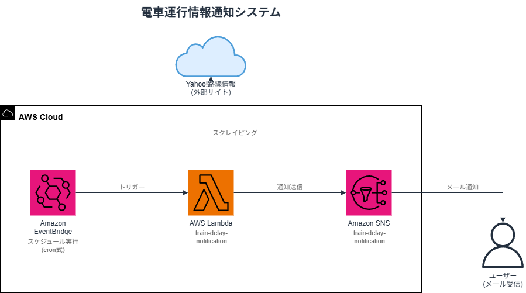

# train-delay-notification

Yahoo!路線情報から指定路線の運行情報を取得するプログラムです。

## 概要

Yahoo!路線情報（ https://transit.yahoo.co.jp/traininfo/ ）から対象路線の運行情報（路線名・状況・詳細）を取得して表示します。

### システム構成図



### 対象路線

| 路線名 | URL |
|--------|-----|
| 宇都宮線[東京～宇都宮] | https://transit.yahoo.co.jp/traininfo/detail/46/46/ |
| 宇都宮線[宇都宮～黒磯] | https://transit.yahoo.co.jp/traininfo/detail/46/47/ |
| 東京メトロ銀座線 | https://transit.yahoo.co.jp/traininfo/detail/132/0/ |

### 使用技術

- Python 3.12
- BeautifulSoup4（HTMLパース）
- requests（HTTP通信）
- Docker（検証環境）

## ファイル構成

```
train-delay-notification/
├── train_delay_notification.py  # メインプログラム
├── Dockerfile                   # 検証環境用
├── spec/
│   └── requirement.md           # プロジェクト仕様書
└── README.md
```

## 検証方法

### 1. Dockerイメージのビルド

```bash
docker build --no-cache -t train-delay .
```

### 2. 実行

```bash
docker run --rm train-delay
```

### 出力例

```
=== 運行情報 ===

  路線名: 宇都宮線[東京～宇都宮]
  状況: 平常運転
  詳細: 現在、事故・遅延に関する情報はありません。

  路線名: 宇都宮線[宇都宮～黒磯]
  状況: 平常運転
  詳細: 現在、事故・遅延に関する情報はありません。

  路線名: 東京メトロ銀座線
  状況: 平常運転
  詳細: 現在、事故・遅延に関する情報はありません。
```
